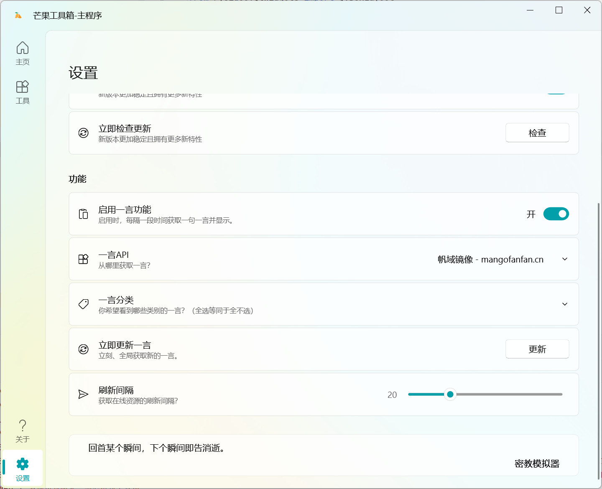

# 一言

（`0.2.2`+）

    「所谓一言（ヒトコト），即一句话。这句话可以是传达了感动，可以是博人一笑，可以是发人深思。总之，一言，代表着言语的触动，灵魂的交流。」
    ——一言开发者中心（https://developer.hitokoto.cn/introduce.html）

## 刷新逻辑
重构后的工具箱内建一个全局的一言管理器（HitokotoManager），所有一言卡片或其他动态加载一言的地方都从该全局管理器获取一言。
* 一旦全局管理器获取新的一言，则所有地方的一言文本都会同步更新。
* 这意味着所有地方显示的一言都是同一句话。
* 对每一个地方的一言进行刷新，都会触发全局管理器的刷新，从而在全局获取新的一言，改变所有地方显示的一言。

大概是这样。

## 调用接口
与重构之前的早期版本一致，工具箱的一言使用**[Hitokoto](https://developer.hitokoto.cn/)**实现，提供官方接口（v1.hitokoto.cn）和芒果的帆域镜像接口（fan-hitokoto.mangofanfan.cn）。镜像接口的唯一好处在于没有访问限制（QPS），此外两个接口完全一致。

如果您对这个一言接口感兴趣，可以参阅以下链接来了解更多：
* [官方文档 - 部署实例](https://developer.hitokoto.cn/sentence/deploy.html)
* [帆域 - 宝塔面板 + Docker 自建 Hitokoto API](https://ifanspace.top/2024/08/26/489.html)
